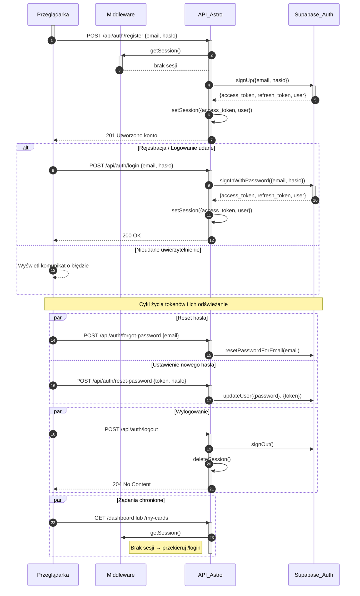

<authentication_analysis>
- Przepływy: Rejestracja, Logowanie, Wylogowanie, Reset hasła, Sesja i odświeżanie tokenów.
- Aktorzy: Przeglądarka, Middleware, API Astro, Supabase Auth.
- Procesy: signUp, signInWithPassword, signOut, resetPasswordForEmail, updateUser({password},{token}), setSession, getSession, deleteSession.
- Kroki: formularz → POST, Zod walidacja, wywołanie Supabase Auth, setSession, redirect, middleware → weryfikacja sesji.
</authentication_analysis>

<mermaid_diagram>

</mermaid_diagram> 