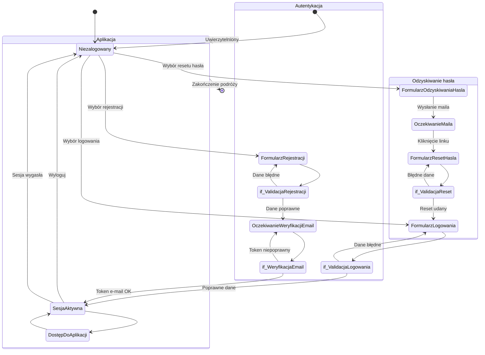

<user_journey_analysis>
1. Ścieżki użytkownika z PRD i specyfikacji:
   - Rejestracja konta (US-001)
   - Logowanie (US-002)
   - Odzyskiwanie hasła (zapomniane hasło i reset token)
   - Podstawowy dostęp do aplikacji po zalogowaniu (US-003, US-004, US-005)
   - Wylogowanie i sesja wygasła

2. Główne podróże i stany:
   - Niezalogowany: użytkownik bez sesji
   - FormularzLogowania: ekran logowania
   - FormularzRejestracji: ekran rejestracji
   - FormularzOdzyskiwaniaHasla: ekran podania e-mail do resetu
   - OczekiwanieMaila: stan po wysłaniu maila (reset lub weryfikacja)
   - FormularzResetHasla: ekran ustawienia nowego hasła
   - OczekiwanieWeryfikacjiEmail: stan oczekiwania weryfikacji
   - SesjaAktywna: zalogowany użytkownik
   - DostępDoAplikacji: widoki głównej funkcjonalności

3. Punkty decyzyjne:
   - if_ValidacjaLogowania: dane logowania poprawne vs błędne
   - if_ValidacjaRejestracji: dane rejestracji poprawne vs błędne
   - if_WeryfikacjaEmail: token e-mail poprawny vs błędny
   - if_ValidacjaReset: nowe hasło poprawne vs błędne

4. Opis celu każdego stanu:
   - Niezalogowany: wybór akcji (logowanie, rejestracja, reset)
   - Formularz*: interakcja użytkownika przy podawaniu danych
   - Oczekiwanie*: proces wysyłki maila i potwierdzenia akcji
   - SesjaAktywna: dostęp do chronionych widoków
   - DostępDoAplikacji: generowanie i zarządzanie fiszkami
</user_journey_analysis>

<mermaid_diagram>

</mermaid_diagram> 