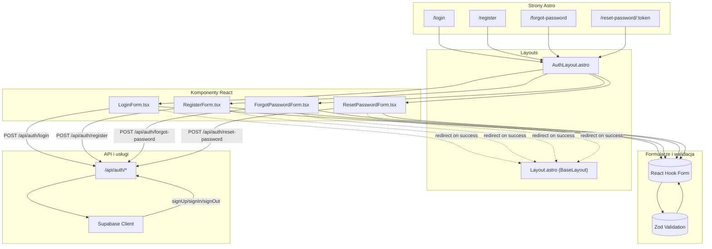

<architecture_analysis>
- Komponenty z specyfikacji:
  • Layouty: AuthLayout (src/layouts/AuthLayout.astro), BaseLayout (src/layouts/BaseLayout.astro lub Layout.astro)
  • Strony Astro: /login, /register, /forgot-password, /reset-password/[token]
  • React: LoginForm.tsx, RegisterForm.tsx, ForgotPasswordForm.tsx, ResetPasswordForm.tsx
  • Walidacja i formularze: React Hook Form + Zod
  • Usługi: komunikacja fetch → /api/auth/*, klient Supabase
- Główne grupy i przepływ danych:
  1. Strony Astra renderują się w odpowiednich layoutach
  2. Layout AuthLayout osadza właściwy komponent formularza React
  3. Komponent formularza korzysta z React Hook Form + Zod do walidacji
  4. Po walidacji wysyła fetch do endpointu API
  5. API wykorzystuje Supabase Client, zwraca odpowiedź
  6. Po sukcesie formularz wyzwala redirect do stron chronionych w layout BaseLayout
- Krótki opis:
  • AuthLayout: wspólny kontener dla formularzy uwierzytelniania
  • Layout.astro: główny layout dla aplikacji (BaseLayout)
  • Formularze React: obsługa interakcji i walidacji
  • React Hook Form + Zod: zarządzanie stanem formularza i walidacja
  • API/auth: endpointy auth zapewniające logikę backendową
  • Supabase Client: klient do komunikacji z usługą Supabase Auth
</architecture_analysis>

<mermaid_diagram>

</mermaid_diagram> 